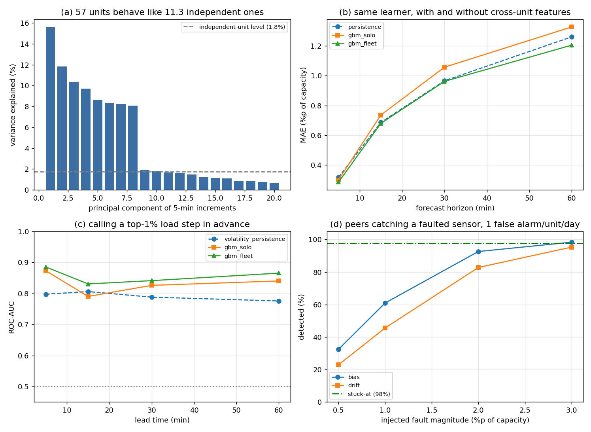
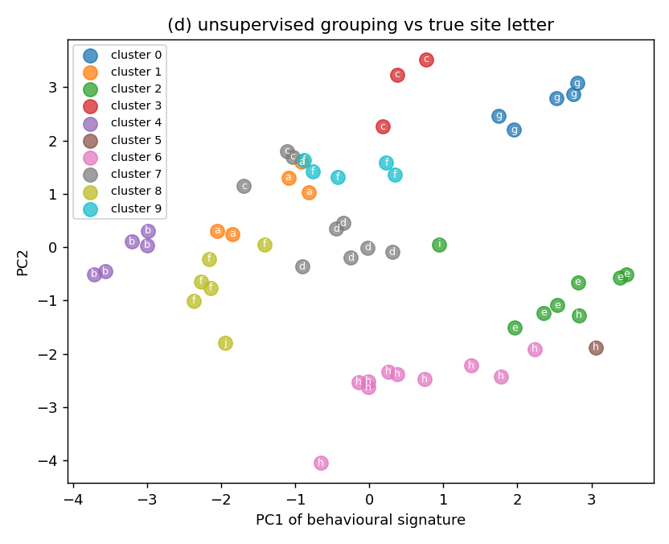

# Fleet layer — 다수 유닛 · 다중 센서에 대한 ML 적용성 검증

`par/fleet.py` 자동 생성. 데이터: Google `powerdata_2019`, 57 PDU × 8,928 스텝 × 4 센서 채널(계측 전력, 추정 생산 전력, 품질 플래그 2종). 학습 1~20일 / 검증 21~31일, 한 번 분할하고 검증 구간에서는 재학습하지 않는다.

설계 근거와 전체 스펙은 [SPEC.md](SPEC.md), 단일 유닛 리스크 결과는 [RESULTS.md](RESULTS.md).

## 0. 결론 표

| 통합 솔루션에서의 ML 기능    | 이 데이터에서의 대응물                      | 실측 결과 (검증 구간)                                               | 선박엔진 함대로의 이전 가능성                    |
|:-------------------|:----------------------------------|:------------------------------------------------------------|:------------------------------------|
| 다수 유닛 동시성 진단       | 57 PDU의 5분 부하 증분 상관구조             | 유효 독립 유닛 11.3/57대. 집합 램프 변동성이 독립 가정 대비 2.6배(1시간 3.0배)       | 높음 — 상관구조 추정 자체는 부하의 물리적 종류를 타지 않는다 |
| 교차 유닛 예측 (통합의 순이득) | 동일 GBM 학습기, 피처셋만 자기이력 → 함대 전체로 교체 | MAE -3.8~-6.0%, 5분 예측에서 57대 중 54대 개선 (Wilcoxon p=7.5e-11)   | 중간 — 이득 크기는 유닛 간 부하 상관도에 비례한다       |
| 급변(램프) 사전 탐지       | 상위 1% 부하 스텝, 리드타임 5~60분           | ROC-AUC 0.83~0.89, 상위 알람 정밀도 22~33% (기저율 0.7% → 33~41배 리프트) | 높음 — 부하추종 지령·예비력 기동의 직접 입력          |
| 가상센서 / 해석적 이중화     | 한 유닛의 계측을 지우고 나머지 56대로 복원         | 검증 구간 R² 중앙값 0.955, 54/57대에서 유효                             | 높음 — 계측 이중화 논리는 물리량을 가리지 않는다        |
| 센서 고장 검출 (주입 시험)   | bias·drift·stuck 고장을 인위 주입 후 재탐지  | stuck 98%, bias 2%p 93%, 오경보 1건/대·일 고정                      | 중간 — 검출 하한이 유닛 간 상관도에 직접 좌우된다       |
| 무라벨 자산 군집화         | 행태 지문 11종 → KMeans (사이트 라벨 미제공)   | k=10, ARI 0.710 (무작위 배정 95% 상한 0.048)                       | 높음 — 라벨 없이 함대를 duty 프로파일로 나눈다       |

## 1. 유닛 간 결합 — N대는 N대만큼 독립적이지 않다

| 지표                        | 값                |
|:--------------------------|:-----------------|
| 유효 독립 유닛 수 (증분 기준)        | 11.3 / 57        |
| 유효 독립 유닛 수 (레벨 기준)        | 5.5 / 57         |
| 90% 분산 설명에 필요한 주성분        | 14개              |
| 평균 쌍별 상관 (증분)             | 0.108            |
| 다양성 계수 (집합 피크 ÷ 개별 피크 평균) | 0.966            |
| 집합 5분 램프 표준편차             | 0.174 %p         |
| └ 독립 가정 대비                | 2.60배            |
| 집합 1시간 램프 표준편차            | 0.780 %p         |
| └ 독립 가정 대비                | 2.96배            |
| 개별 유닛 1시간 램프 p99.9 (평균)   | 7.35 %p          |
| 집합 1시간 램프 p99.9           | 2.46 %p          |
| 집합 상위 1% 상승 시 동반 상승 유닛 비율 | 72.3% (평시 43.4%) |

개별 유닛은 1시간에 ±7.4 %p까지 흔들리지만 집합은 ±2.5 %p로 잦아든다 — 상쇄는 분명히 일어난다. 다만 완전 독립이라면 여기서 한 번 더, 3.0배만큼 줄었어야 한다. 그 차이가 곧 추가로 확보해야 하는 부하추종 여력이다.

## 2. 예측 — 같은 학습기, 피처셋만 교체

모든 학습기는 레벨이 아니라 **증분**을 타깃으로 한다. 그래야 persistence가 정확히 '0 예측'이 되어 skill이 곧 추가 정보량이 되고, 트리 모델이 학습 범위 밖 레벨을 외삽하지 못하는 불이익도 사라진다. 점수는 레벨로 환산해 매겼다.

|   horizon_min | model       |   mae_pp |   rmse_pp |   skill_vs_persistence |   p95_abs_err_pp |
|--------------:|:------------|---------:|----------:|-----------------------:|-----------------:|
|             5 | persistence |   0.3177 |    0.4593 |                 0      |           1      |
|             5 | ridge_solo  |   0.2906 |    0.4015 |                 0.0852 |           0.8286 |
|             5 | ridge_fleet |   0.2917 |    0.4018 |                 0.0819 |           0.8274 |
|             5 | gbm_solo    |   0.3009 |    0.4153 |                 0.0527 |           0.8559 |
|             5 | gbm_fleet   |   0.2857 |    0.3978 |                 0.1005 |           0.8234 |
|            15 | persistence |   0.6865 |    1.0028 |                 0      |           2.1    |
|            15 | ridge_solo  |   0.6744 |    0.9466 |                 0.0177 |           1.9525 |
|            15 | ridge_fleet |   0.6832 |    0.9531 |                 0.0049 |           1.9596 |
|            15 | gbm_solo    |   0.7359 |    1.0274 |                -0.0719 |           2.1331 |
|            15 | gbm_fleet   |   0.68   |    0.9578 |                 0.0095 |           1.9834 |
|            30 | persistence |   0.9658 |    1.3997 |                 0      |           2.9    |
|            30 | ridge_solo  |   0.9475 |    1.312  |                 0.019  |           2.6981 |
|            30 | ridge_fleet |   0.9647 |    1.3261 |                 0.0011 |           2.7136 |
|            30 | gbm_solo    |   1.0569 |    1.4711 |                -0.0944 |           3.1074 |
|            30 | gbm_fleet   |   0.9617 |    1.3359 |                 0.0042 |           2.7461 |
|            60 | persistence |   1.2604 |    1.8051 |                 0      |           3.7    |
|            60 | ridge_solo  |   1.224  |    1.6567 |                 0.0289 |           3.3566 |
|            60 | ridge_fleet |   1.2559 |    1.694  |                 0.0036 |           3.4378 |
|            60 | gbm_solo    |   1.3269 |    1.8374 |                -0.0527 |           3.768  |
|            60 | gbm_fleet   |   1.2048 |    1.6658 |                 0.0442 |           3.422  |

### 2.1 유닛 단위 페어 검정 (반복 단위 = 57대)

18만 행을 pooled로 검정하면 자기상관 때문에 무엇이든 유의해진다. 유닛별 MAE로 접어서 57쌍 Wilcoxon으로 검정한다.

|   horizon_min | better      | vs          |   median_mae_gain_pct |   units_improved |   n_units |   wilcoxon_p |
|--------------:|:------------|:------------|----------------------:|-----------------:|----------:|-------------:|
|             5 | gbm_fleet   | gbm_solo    |                4.3605 |               54 |        57 |      7.5e-11 |
|             5 | ridge_fleet | ridge_solo  |                0.178  |               31 |        57 |      0.98    |
|             5 | gbm_fleet   | persistence |                8.731  |               57 |        57 |      5.1e-11 |
|             5 | gbm_solo    | persistence |                3.75   |               42 |        57 |      9.1e-06 |
|            15 | gbm_fleet   | gbm_solo    |                4.9735 |               51 |        57 |      1.2e-09 |
|            15 | ridge_fleet | ridge_solo  |               -0.8607 |               22 |        57 |      0.0058  |
|            15 | gbm_fleet   | persistence |               -0.2285 |               27 |        57 |      0.59    |
|            15 | gbm_solo    | persistence |               -6.9575 |               11 |        57 |      3.1e-08 |
|            30 | gbm_fleet   | gbm_solo    |                3.8372 |               45 |        57 |      4.6e-07 |
|            30 | ridge_fleet | ridge_solo  |               -0.5663 |               20 |        57 |      0.0032  |
|            30 | gbm_fleet   | persistence |               -1.07   |               28 |        57 |      0.97    |
|            30 | gbm_solo    | persistence |               -5.9722 |               16 |        57 |      5e-05   |
|            60 | gbm_fleet   | gbm_solo    |                5.9847 |               45 |        57 |      2.1e-06 |
|            60 | ridge_fleet | ridge_solo  |               -0.7607 |               24 |        57 |      0.026   |
|            60 | gbm_fleet   | persistence |                7.2615 |               39 |        57 |      0.00015 |
|            60 | gbm_solo    | persistence |                1.448  |               32 |        57 |      0.38    |

읽는 법 세 가지.

1. **함대 피처는 GBM에 대해 모든 horizon에서 이긴다** — 57대 중 45~54대, p ≤ 2e-6. 학습기·하이퍼파라미터·타깃이 동일하고 피처셋만 바뀌었으므로 이 차이는 교차 유닛 정보의 순기여다.
2. **같은 정보를 릿지는 쓰지 못한다** — `ridge_fleet`는 `ridge_solo`를 이기지 못하고 오히려 근소하게 진다. 교차 유닛 신호가 비선형이라는 뜻이고, 이것이 이 문제에 통계 회귀가 아니라 ML이 필요한 이유다.
3. **레벨 예측 자체는 5분·1시간에서만 persistence를 이긴다** — 15·30분에서는 무승부다. 부하 레벨은 그 구간에서 거의 랜덤워크다. 따라서 이 데이터가 지지하는 주장은 '레벨을 잘 맞힌다'가 아니라 **'급변을 미리 부른다'**(§3)이다.

## 3. 램프 사전 탐지

이벤트 정의: horizon h 동안의 상승폭이 **학습 구간** 증분 분포의 99분위를 넘는 경우. 임계값은 학습 구간에서 고정하고 검증 구간에 그대로 적용한다.

|   horizon_min |   threshold_pp |   n_events |   base_rate | detector               |    auc |   avg_precision |   precision_at_n |
|--------------:|---------------:|-----------:|------------:|:-----------------------|-------:|----------------:|-----------------:|
|             5 |            1.4 |       1442 |      0.008  | volatility_persistence | 0.7974 |          0.0351 |           0.0673 |
|             5 |            1.4 |       1442 |      0.008  | gbm_solo               | 0.8732 |          0.2437 |           0.3252 |
|             5 |            1.4 |       1442 |      0.008  | gbm_fleet              | 0.8852 |          0.2557 |           0.3266 |
|            15 |            3.2 |       1231 |      0.0068 | volatility_persistence | 0.8059 |          0.0395 |           0.0788 |
|            15 |            3.2 |       1231 |      0.0068 | gbm_solo               | 0.7902 |          0.1229 |           0.212  |
|            15 |            3.2 |       1231 |      0.0068 | gbm_fleet              | 0.8306 |          0.1147 |           0.2226 |
|            30 |            4.4 |       1231 |      0.0068 | volatility_persistence | 0.7879 |          0.0438 |           0.0991 |
|            30 |            4.4 |       1231 |      0.0068 | gbm_solo               | 0.826  |          0.1375 |           0.2234 |
|            30 |            4.4 |       1231 |      0.0068 | gbm_fleet              | 0.8412 |          0.1554 |           0.2234 |
|            60 |            5.4 |       1236 |      0.0069 | volatility_persistence | 0.7756 |          0.0367 |           0.0882 |
|            60 |            5.4 |       1236 |      0.0069 | gbm_solo               | 0.8401 |          0.1665 |           0.2176 |
|            60 |            5.4 |       1236 |      0.0069 | gbm_fleet              | 0.8653 |          0.1939 |           0.2403 |

## 4. 가상센서 — 이웃으로 한 대를 복원

| 지표            | 값                                |
|:--------------|:---------------------------------|
| 검증 구간 R² 중앙값  | 0.955                            |
| R² > 0.5 유닛   | 54 / 57                          |
| 복원 실패 유닛      | h/pdu45, i/mvpp1, j/mvpp2        |
| 실제 플래그 탐지 AUC | 0.508 (95% CI 0.40~0.62, 양성 24건) |

실제 `bad_measurement_data` 플래그에 대한 AUC는 0.5와 구분되지 않는다. SPEC §3.1대로 그 플래그는 텔레메트리 유실 표시지 이상 계측값이 아니므로 잔차가 반응할 대상이 없다. **음성 결과이며 예상된 것이다.**

### 4.1 고장 주입 시험

라벨된 실제 센서 고장이 없으므로 만들어 넣는다. 한 번에 한 유닛의 채널에만 고장을 주입하고, 이웃 기반 복원 잔차를 다시 계산해 탐지 여부를 본다. 임계값은 **정상 검증 구간에서 오경보 1건/대·일**이 되도록 고정했다.

| fault   |   magnitude_pp |   units_tested |   trials |   detection_rate |   median_lag_min |   false_alarms_per_unit_day |
|:--------|---------------:|---------------:|---------:|-----------------:|-----------------:|----------------------------:|
| bias    |            0.5 |             54 |     1080 |            0.324 |            140   |                           1 |
| bias    |            1   |             54 |     1080 |            0.609 |             32.5 |                           1 |
| bias    |            2   |             54 |     1080 |            0.926 |              0   |                           1 |
| bias    |            3   |             54 |     1080 |            0.983 |              0   |                           1 |
| drift   |            0.5 |             54 |     1080 |            0.229 |            420   |                           1 |
| drift   |            1   |             54 |     1080 |            0.456 |            462.5 |                           1 |
| drift   |            2   |             54 |     1080 |            0.828 |            395   |                           1 |
| drift   |            3   |             54 |     1080 |            0.953 |            310   |                           1 |
| stuck   |          nan   |             54 |     1080 |            0.976 |             55   |                           1 |

## 5. 무라벨 군집화

|   k |   silhouette |   ari_vs_cell |
|----:|-------------:|--------------:|
|   2 |        0.263 |         0.197 |
|   3 |        0.302 |         0.307 |
|   4 |        0.303 |         0.387 |
|   5 |        0.327 |         0.44  |
|   6 |        0.382 |         0.487 |
|   7 |        0.409 |         0.617 |
|   8 |        0.424 |         0.581 |
|   9 |        0.457 |         0.61  |
|  10 |        0.463 |         0.71  |

실루엣 최대인 k=10 선택, ARI=0.710. 무작위 배정의 ARI 95% 상한은 0.048이다. 군집기에 사이트(cell) 라벨은 한 번도 주지 않았다.

## 6. 이 데이터로 검증되지 않는 것

- **전기적 물리량 부재.** 값은 전부 용량 대비 비율이다. kW·전압·전류·역률·고조파가 없으므로 아크·불평형 같은 전기적 이상은 관측 대상이 아니다.
- **회전기계 신호 부재.** 진동·온도·압력·연료유량이 없다. 엔진 자체의 예지정비는 이 데이터로 검증되지 않으며, 여기서 검증한 것은 **함대 수준의 부하·계측 통합 로직**이다.
- **1개월.** 계절성 검증 불가.
- **2019년.** GPU 가속기 워크로드 이전 시기다. 현행 AI 클러스터의 전력 동조 특성은 이 트레이스로 대표되지 않으며, §1의 결합 수치는 하한으로 읽어야 한다.

## 7. 그림

