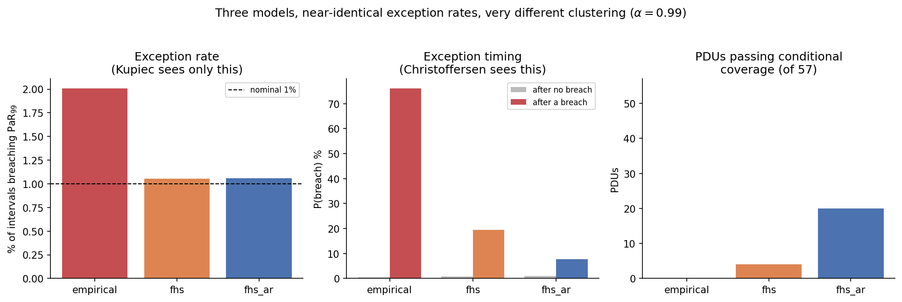
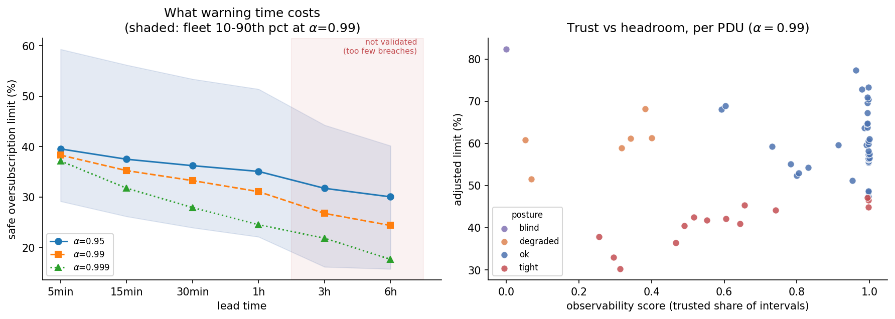

# Results

Generated by `par/report.py`. Data: 508,896 rows, 57 PDUs, May 2019.

## A-layer backtests (pooled)

| model | alpha | rate | expected | Kupiec p | indep p | ES Z2 | PDUs passing CC |
|---|---|---|---|---|---|---|---|
| empirical | 0.95 | 0.0758 | 0.0500 | 0 | 0 | +0.519 | 0/57 |
| fhs | 0.95 | 0.0501 | 0.0500 | 0.879 | 0 | +0.001 | 0/57 |
| fhs_ar | 0.95 | 0.0503 | 0.0500 | 0.35 | 0 | +0.007 | 10/57 |
| empirical | 0.99 | 0.0201 | 0.0100 | 0 | 0 | +1.013 | 0/57 |
| fhs | 0.99 | 0.0106 | 0.0100 | 0.000345 | 0 | +0.058 | 4/57 |
| fhs_ar | 0.99 | 0.0106 | 0.0100 | 0.000229 | 1e-163 | +0.060 | 20/57 |

## Exception clustering

| model | P(breach after none) | P(breach after breach) | ratio |
|---|---|---|---|
| empirical | 0.0049 | 0.7614 | 155.7x |
| fhs | 0.0086 | 0.1938 | 22.5x |
| fhs_ar | 0.0099 | 0.0778 | 7.9x |

## Horizon calibration (out of sample)

Multiplier fitted on days 8-18, applied unchanged to days 19-31.
`breaches/PDU` is the calibration signal available in the held-out
half -- below ~2 there is nothing to calibrate against.

| lead | alpha | m | rate before | rate after | breaches/PDU | verdict |
|---|---|---|---|---|---|---|
| 5min | 0.95 | 0.996 | 0.0498 | 0.0503 | 186.4 | validated |
| 5min | 0.99 | 1.016 | 0.0105 | 0.0098 | 39.4 | validated |
| 5min | 0.999 | 1.083 | 0.0015 | 0.0009 | 5.6 | validated |
| 15min | 0.95 | 0.998 | 0.0493 | 0.0496 | 61.6 | validated |
| 15min | 0.99 | 1.034 | 0.0106 | 0.0091 | 13.2 | validated |
| 15min | 0.999 | 1.126 | 0.0016 | 0.0009 | 2.1 | marginal |
| 30min | 0.95 | 0.976 | 0.0513 | 0.0545 | 32.0 | validated |
| 30min | 0.99 | 1.038 | 0.0123 | 0.0103 | 7.6 | validated |
| 30min | 0.999 | 1.146 | 0.0022 | 0.0013 | 1.4 | underpowered |
| 1h | 0.95 | 0.971 | 0.0553 | 0.0590 | 17.2 | marginal |
| 1h | 0.99 | 1.023 | 0.0142 | 0.0124 | 4.4 | marginal |
| 1h | 0.999 | 1.217 | 0.0029 | 0.0017 | 0.9 | underpowered |
| 3h | 0.95 | 1.001 | 0.0521 | 0.0521 | 5.4 | validated |
| 3h | 0.99 | 1.141 | 0.0123 | 0.0051 | 1.3 | underpowered |
| 3h | 0.999 | 1.220 | 0.0032 | 0.0008 | 0.3 | underpowered |
| 6h | 0.95 | 0.964 | 0.0644 | 0.0698 | 3.4 | underpowered |
| 6h | 0.99 | 1.072 | 0.0182 | 0.0145 | 0.9 | underpowered |
| 6h | 0.999 | 1.271 | 0.0101 | 0.0027 | 0.5 | underpowered |

## Oversubscription limit vs lead time

| lead | alpha | tightest PDU | fleet median | fleet p90 | verdict |
|---|---|---|---|---|---|
| 5min | 0.95 | +25.8% | +39.5% | +60.1% | validated |
| 5min | 0.99 | +24.7% | +38.3% | +59.3% | validated |
| 5min | 0.999 | +23.4% | +37.2% | +57.0% | validated |
| 15min | 0.95 | +23.3% | +37.5% | +58.8% | validated |
| 15min | 0.99 | +20.8% | +35.3% | +56.2% | validated |
| 15min | 0.999 | +17.4% | +31.8% | +52.7% | marginal |
| 30min | 0.95 | +22.1% | +36.2% | +57.6% | validated |
| 30min | 0.99 | +18.4% | +33.3% | +53.4% | validated |
| 30min | 0.999 | +14.0% | +27.9% | +49.6% | underpowered |
| 1h | 0.95 | +21.1% | +35.1% | +55.3% | marginal |
| 1h | 0.99 | +16.9% | +31.1% | +51.4% | marginal |
| 1h | 0.999 | +12.0% | +24.5% | +46.8% | underpowered |
| 3h | 0.95 | +19.0% | +31.7% | +50.2% | validated |
| 3h | 0.99 | +11.7% | +26.8% | +44.3% | underpowered |
| 3h | 0.999 | +7.0% | +21.8% | +40.3% | underpowered |
| 6h | 0.95 | +15.7% | +30.0% | +46.0% | underpowered |
| 6h | 0.99 | +9.5% | +24.4% | +40.2% | underpowered |
| 6h | 0.999 | +3.8% | +17.6% | +34.3% | underpowered |

## Fleet posture (alpha=0.99)

| posture | PDUs |
|---|---|
| blind | 1 |
| degraded | 6 |
| ok | 36 |
| tight | 14 |

