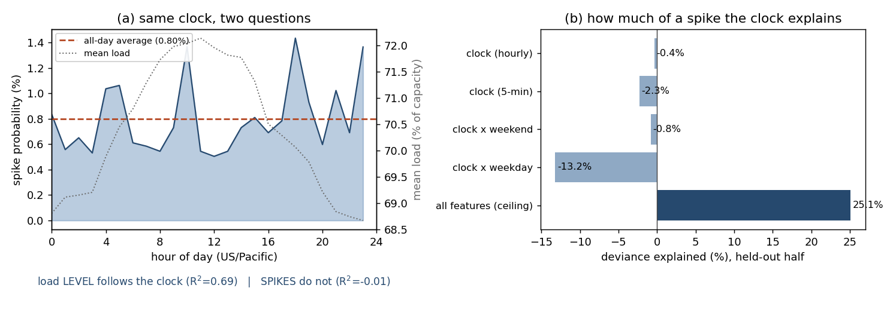

# 시계 하나로 급변이 얼마나 설명되는가

`par/tod.py` 자동 생성. 피처는 **하루 중 시각 하나뿐**, 타깃은 **급변 여부(0/1)** — 다음 h 구간 부하 상승폭이 학습 구간 99분위(1.4 %p)를 넘는 경우다. 학습 1~20일 / 검증 21~31일.

설명력은 검증 구간의 **이탈도 설명률**(1 − D_model/D_null)로 잰다. 0/1 타깃에서 R²에 해당하는 값이고, 음수는 '기저율만 말하는 것보다 못하다'는 뜻이다.

## 한 문장

**같은 시계 피처가 부하 '레벨'은 69% 설명하는데(R²=0.69), '급변'은 0% 설명한다**(검증 설명력 -2.3%, AUC 0.55). 같은 데이터에 전체 피처를 쓰면 25.1%(AUC 0.92)까지 올라간다. **즉 급변에 관한 정보는 달력이 아니라 다른 데 있다.**

## 결과

|   horizon_min | feature                          |   deviance_explained |    auc |   avg_precision |   precision_at_n |    lift |
|--------------:|:---------------------------------|---------------------:|-------:|----------------:|-----------------:|--------:|
|             5 | clock_hour                       |              -0.0036 | 0.5247 |          0.0086 |           0.0021 |  0.2604 |
|             5 | clock_hour (in-sample)           |               0.0052 | 0.5627 |          0.0136 |           0.0139 |  1.2493 |
|             5 | clock_5min                       |              -0.0231 | 0.5504 |          0.0096 |           0.0076 |  0.955  |
|             5 | clock_5min (in-sample)           |               0.0402 | 0.682  |          0.0216 |           0.0328 |  2.9395 |
|             5 | clock_hour_x_weekend             |              -0.0084 | 0.5135 |          0.0079 |           0.0007 |  0.0868 |
|             5 | clock_hour_x_weekend (in-sample) |               0.013  | 0.6055 |          0.0157 |           0.024  |  2.1557 |
|             5 | clock_5min_x_dow                 |              -0.1319 | 0.5422 |          0.0092 |           0.009  |  1.1286 |
|             5 | clock_5min_x_dow (in-sample)     |               0.1841 | 0.8695 |          0.0542 |           0.0877 |  7.8633 |
|             5 | base_rate_only                   |               0      | 0.5    |          0.008  |           0.0111 |  1.389  |
|             5 | all_features_ceiling             |               0.2509 | 0.9233 |          0.2169 |           0.2822 | 35.3447 |
|            15 | clock_hour                       |              -0.0027 | 0.539  |          0.008  |           0.0063 |  0.8934 |
|            15 | clock_hour (in-sample)           |               0.0073 | 0.5772 |          0.0128 |           0.0102 |  0.9989 |
|            15 | clock_5min                       |              -0.0332 | 0.532  |          0.0079 |           0.0149 |  2.1218 |
|            15 | clock_5min (in-sample)           |               0.0392 | 0.6797 |          0.0199 |           0.0413 |  4.0542 |
|            15 | clock_hour_x_weekend             |              -0      | 0.5618 |          0.0083 |           0      |  0      |
|            15 | clock_hour_x_weekend (in-sample) |               0.0165 | 0.6166 |          0.0145 |           0.023  |  2.2621 |
|            15 | clock_5min_x_dow                 |              -0.1508 | 0.5255 |          0.0084 |           0.0173 |  2.4569 |
|            15 | clock_5min_x_dow (in-sample)     |               0.1939 | 0.8779 |          0.0533 |           0.0903 |  8.8722 |
|            15 | base_rate_only                   |               0      | 0.5    |          0.007  |           0.0087 |  1.2284 |
|            15 | all_features_ceiling             |               0.1421 | 0.9106 |          0.1191 |           0.1896 | 26.9393 |
|            30 | clock_hour                       |              -0.0028 | 0.5498 |          0.0078 |           0.0227 |  3.3303 |
|            30 | clock_hour (in-sample)           |               0.0121 | 0.5991 |          0.0136 |           0.0173 |  1.7332 |
|            30 | clock_5min                       |              -0.0333 | 0.5271 |          0.0079 |           0.0138 |  2.0219 |
|            30 | clock_5min (in-sample)           |               0.039  | 0.6796 |          0.019  |           0.0341 |  3.4055 |
|            30 | clock_hour_x_weekend             |               0.0072 | 0.5945 |          0.0093 |           0.0138 |  2.0219 |
|            30 | clock_hour_x_weekend (in-sample) |               0.0263 | 0.646  |          0.0159 |           0.0289 |  2.8886 |
|            30 | clock_5min_x_dow                 |              -0.1417 | 0.5352 |          0.0093 |           0.0309 |  4.5196 |
|            30 | clock_5min_x_dow (in-sample)     |               0.1978 | 0.8807 |          0.0519 |           0.0803 |  8.0272 |
|            30 | base_rate_only                   |               0      | 0.5    |          0.0068 |           0.0032 |  0.4758 |
|            30 | all_features_ceiling             |               0.0743 | 0.9072 |          0.1261 |           0.1942 | 28.4801 |
|            60 | clock_hour                       |               0.0014 | 0.5778 |          0.0089 |           0.0138 |  2.0018 |
|            60 | clock_hour (in-sample)           |               0.0176 | 0.6177 |          0.0147 |           0.0154 |  1.4944 |
|            60 | clock_5min                       |              -0.0198 | 0.5519 |          0.008  |           0.0081 |  1.1775 |
|            60 | clock_5min (in-sample)           |               0.0376 | 0.6744 |          0.0185 |           0.0281 |  2.7302 |
|            60 | clock_hour_x_weekend             |               0.0065 | 0.6152 |          0.0108 |           0.0129 |  1.8841 |
|            60 | clock_hour_x_weekend (in-sample) |               0.0385 | 0.6754 |          0.0194 |           0.0352 |  3.4199 |
|            60 | clock_5min_x_dow                 |              -0.1554 | 0.5094 |          0.0081 |           0      |  0      |
|            60 | clock_5min_x_dow (in-sample)     |               0.1863 | 0.8719 |          0.0476 |           0.0757 |  7.3571 |
|            60 | base_rate_only                   |               0      | 0.5    |          0.0069 |           0.0024 |  0.3533 |
|            60 | all_features_ceiling             |               0.0304 | 0.9014 |          0.1689 |           0.2249 | 32.86   |

## 왜 그런가

- 급변 확률이 가장 높은 시각은 18시(1.44%), 가장 낮은 시각은 12시(0.51%), 전일 평균 0.80%. **가장 위험한 시간대라고 해봐야 평균의 1.8배**다.
- 반면 **직전 구간에 급변이 있었으면 다음 구간 급변 확률이 26.6%**로 뛴다 (잠잠했으면 0.59%). **45배**다.
- 즉 급변을 지배하는 것은 **시각이 아니라 직전 상태**다. 시계는 언제 부하가 *높은지*는 잘 설명하지만(일주기), 언제 *튈지*는 거의 설명하지 못한다. 이 둘은 다른 질문이다.
- 해상도를 5분까지 올리거나 요일을 곱해도 늘지 않는다. 오히려 떨어진다 — 학습 구간에서조차 시각의 설명력은 4.0%뿐이고(요일까지 곱하면 18.4%로 보이지만 검증에서 -13.2%로 무너진다), **달력에서 더 짜낼 것이 없다.**

## 그래서

급변이 시계로 설명됐다면 운전 스케줄에 적어두면 끝이고 모델은 필요 없다. 실측 결과는 정반대다. **예비력을 시간대 기준으로 편성하면 안 되고, 상태를 실시간으로 보는 모델이 아니면 급변을 미리 알 방법이 없다.** 그 몫이 25.1%p만큼 통째로 비어 있다.

